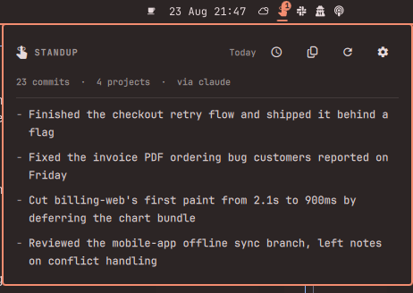

# Omarchy Standup

A short daily standup, written for you from the git activity across all your
project folders, on a schedule you set.



The bar icon badges when a fresh standup is waiting. Click it, read four
bullets, copy them into Slack, get on with your day.

## Features

- **Scans every project you work in.** Point it at `~/Projects`, `~/Work`, or
  both — sub-folders are scanned too, so one entry covers a whole tree of repos.
  Linked git worktrees are recognised, so twenty `myapp-wt-*` folders count as
  one project rather than twenty.
- **Picks up where the last standup stopped.** Monday's standup covers Friday
  automatically. A fixed "last N days" window is there if you prefer it.
- **Filter by author.** Only your commits by default — across every git identity
  you commit under, including per-repo work addresses. Switch to everyone for a
  team digest, or pick specific people from a list built out of your own repos.
- **Uses your default Omarchy agent.** Whatever `omarchy default agent` points
  at writes the summary. You can pin a different one, or give it a **custom
  command** — anything that reads a prompt on stdin, so a local model works:
  `ollama run llama3.2`, `llm -m mistral`, your own script.
- **Runs on a schedule.** Pick a time and the weekdays you want it. A standup
  missed while the machine was asleep is generated at the next login, once.
- **Your format, your words.** Pick a preset — flat bullet list, grouped by
  person, grouped by project, Yesterday/Today/Blockers, one paragraph — or type
  your own instruction. The preset just seeds the text box; whatever is in it is
  what the agent is told.
- **Unread badge** on the bar icon, plus a history of previous standups.
- **Works without an agent.** If none is configured or the call fails, you still
  get a plain per-project commit summary rather than nothing.

## Install

```bash
omarchy plugin add https://github.com/Bottelet/omarchy-standup --enable
omarchy bar put bottelet.standup --after omarchy.clock
```

Then open the panel, press the gear, and set your project folders.

## Usage

| Action | How |
| --- | --- |
| Open the panel | Click the bar icon |
| Generate now | The refresh icon, or middle-click the bar icon |
| Copy the standup | The copy icon |
| Previous standups | The clock icon |
| Settings | The gear icon |

From a terminal or a keybinding:

```bash
omarchy-shell bottelet.standup toggle
omarchy-shell bottelet.standup generate
omarchy-shell bottelet.standup settings
```

The engine is a plain script, so you can use it on its own:

```bash
~/.config/omarchy/plugins/bottelet.standup/scripts/standup.sh \
  generate --roots "~/Projects,~/Work" --window fixed --days 3
```

## Settings

All settings live in the panel's gear page.

| Setting | Default | What it does |
| --- | --- | --- |
| Project folders | `~/Projects` | Comma-separated roots to scan |
| Folder depth | `2` | How deep to look for repos under each root |
| Time range | Since the last standup | Or a fixed number of days |
| Days back | `1` | Used when the range is fixed |
| Whose commits | Only me | Everyone, or a hand-picked set of authors |
| Max bullets | `5` | Upper bound on the generated bullets |
| Format | Bullet list | Preset shapes, or your own wording |
| Agent | Omarchy default | A specific agent, or a custom command |
| Generate automatically | on | Off means manual only |
| At | `09:00` | Time of day to generate |
| Weekdays | Mon–Fri | Which days to generate on |

## Dependencies

`git`, `jq`, `python3`, and `wl-copy` (wl-clipboard) — all present on a stock
Omarchy install. An agent CLI is optional; without one you get the plain
commit summary.

## Privacy and security

Commit subjects, author names, project names and branch names from the window
you configured are sent to whichever agent you selected. Nothing else leaves
the machine — no diffs, no file contents. The plugin itself makes no network
requests of any kind. Choosing a custom command pointed at a local model keeps
everything on the box.

Commit messages are attacker-controlled text in any repository you merely
cloned, so the agent is run **without tools** wherever its CLI supports it
(`claude --tools ""`, `codex --sandbox read-only`, `gemini --approval-mode
plan`) and always in an empty working directory. Agents with no such switch —
opencode, copilot, pi, omp, grok — run with their own defaults; pick one of the
first three if that matters to you.

Generated standups live in `~/.local/share/omarchy-standup/`, created mode
`700`. See [SECURITY.md](SECURITY.md) for the full posture.

## Remove

```bash
omarchy plugin remove bottelet.standup
```

Generated standups stay in `~/.local/share/omarchy-standup/`; delete that
folder to remove them too. Settings live in the widget's entry in
`~/.config/omarchy/shell.json` and go away with the widget.

## Tests

```bash
tests/run.sh
```

86 offline checks (plus 70 in `Model.js`): repo discovery and worktree
de-duplication, author filtering, window handling, agent output sanitising, the
no-agent fallback, custom commands, unread bookkeeping, the schedule logic, and
the hardening guards below.
